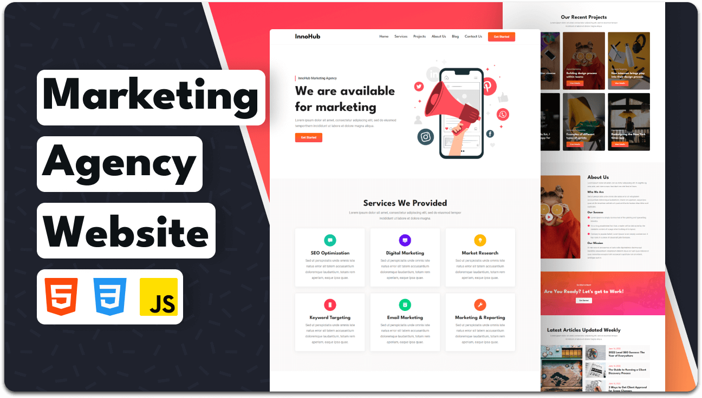

  
  
  
  
[
  

   
   

  <h2 align="center">InnoHub - Digital Marketing Agency Website</h2>

  InnoHub is a fully responsive digital marketing agency website,  Responsive for all devices, build using HTML, CSS, and JavaScript.

  <a href="https://codewithsadee.github.io/innohub/"><strong>➥ Live Demo</strong></a>

 

### Demo Screeshots

 

### Contact

If you want to contact with me you can reach me at(https://anupkankale.github.io/portf/).

### License

This project is **free to use** and does not contains any license.
